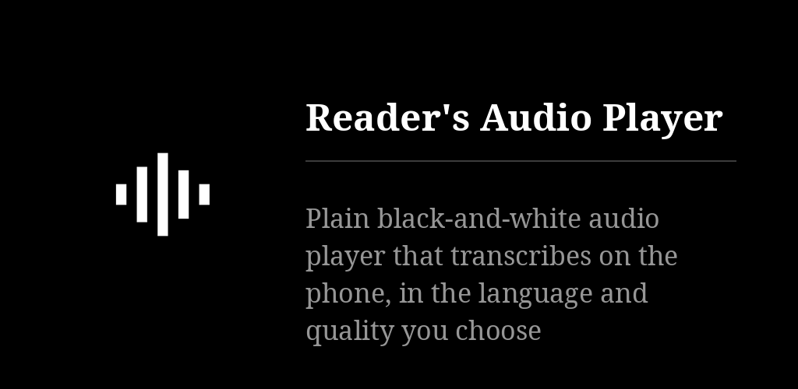
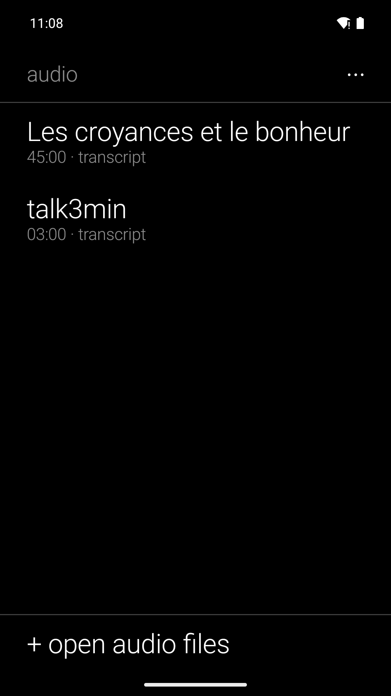
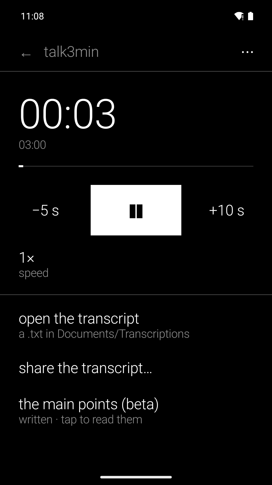

# Reader's Audio Player

A black-and-white, text-only audio player for Android, in the
[Reader's](https://github.com/funkypitt/readers-launcher) family. Deliberately plain: the
playback is AndroidX **Media3** (ExoPlayer + MediaSession), the standard engine, so the
notification, lock screen, Bluetooth and headset buttons behave the way Android expects.
The one addition is **transcription on the phone** with whisper.cpp — and, if you want it,
**the main points of what was said**, written on the phone too.

* **A list**, last played first; each file resumes where it was left. "+ open audio files"
  picks files anywhere on the phone; "open with" and "share to" from any app work too.
* **The player**: the time, large; a line to tap to jump; −5 s · ▶ / ❚❚ · +10 s; speed
  (0.8× to 2×).
* **The notification** is Media3's standard media notification: −5 s, play/pause, +10 s, stop.
* **Transcribe**: before each transcription a small sheet asks the language spoken (the
  phone's by default, English, detected, or French, German, Spanish, Portuguese, Russian,
  Italian) and the quality: normal (Whisper small, 190 MB, the default) or high quality, much
  slower (large-v3-turbo, 574 MB). Models are fetched once. whisper.cpp runs on the phone, the
  file decoded in five-minute pieces so a long audiobook never sits in memory whole; each piece
  is primed with a short, well-punctuated sentence in the chosen language and the end of the
  previous piece, so the text keeps full sentences, commas and capitals. Paragraphs break only
  where a sentence has ended, after a pause or past ~600 characters.
  The transcript is a plain `.txt` in **Documents/Transcriptions**, which any reader opens —
  Reader's Books included.
* **The main points**, an option in the same sheet, off until you ask for it. The first tap
  fetches a three-billion parameter model (Qwen2.5 3B Instruct, Q4_K_M, 1.93 GB, once);
  [llama.cpp](https://github.com/ggml-org/llama.cpp) is vendored beside whisper.cpp and runs it
  on the processor alone. The transcript is read in pieces of about 900 words, each asked for its
  points, and the notes are merged into eight; the instruction asks for one thing only, which is
  what a model this size can actually obey. The points are written at the top of the same `.txt`,
  above the transcript, so whatever you open or share carries them. A phone with less than about
  6 GB of memory is not offered the option — it could not hold the model. The transcript is saved
  **before** the summary is attempted, and any failure is silent: an hour of transcription is
  never at the mercy of the points. * **Share** the audio or the transcript to any app, and **save a copy to a folder…** straight
  from the player, through the system's own folder picker — no file manager needed.
* **Widget**: the last file played; ▶ resumes it where it stopped (Media3 playback
  resumption), the title opens the player.
* English, French, German, Spanish, Portuguese, Russian. Nothing leaves the phone.

## Building

```
git clone --recursive https://github.com/funkypitt/readers-audio.git   # or: git submodule update --init
export JAVA_HOME=/path/to/jdk-21
./gradlew assembleDebug
```

minSdk 29 (transcripts are written to Documents through MediaStore, without a storage
permission), targetSdk 34, NDK 27.1, CMake 3.22.1. Everything that listens and summarises —
whisper.cpp, llama.cpp, the models and the code around them — lives in the
[readers-speech](https://github.com/funkypitt/readers-speech) module, a git submodule at `speech/`
shared with Reader's Recorder. The two apps also share the model files themselves: one downloaded
by either is read by the other through a content provider, so the two gigabytes exist once.

## Licence

MIT. Media3 is Apache 2.0, whisper.cpp MIT.

## Captures d'écran

 
