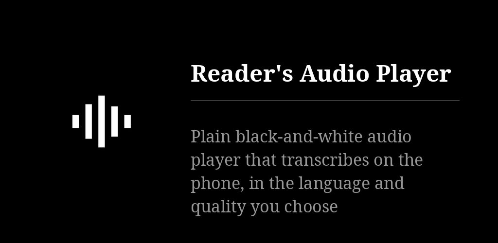
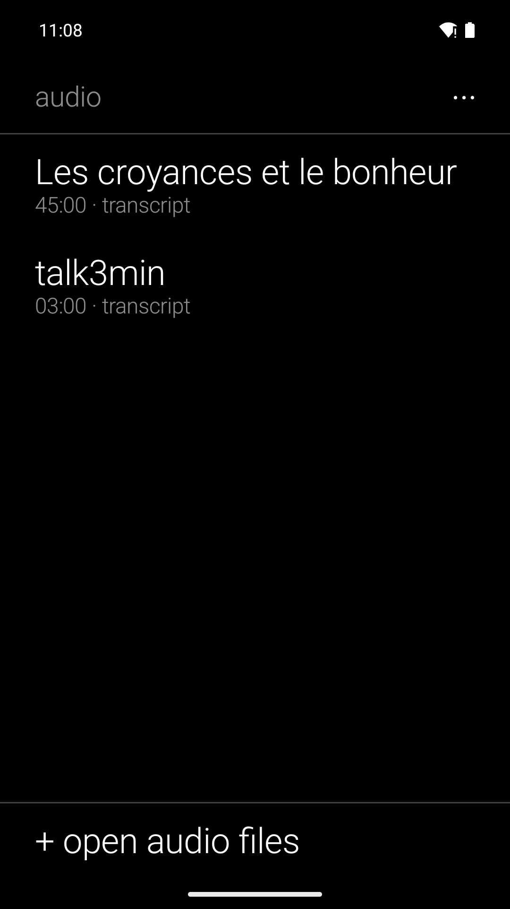
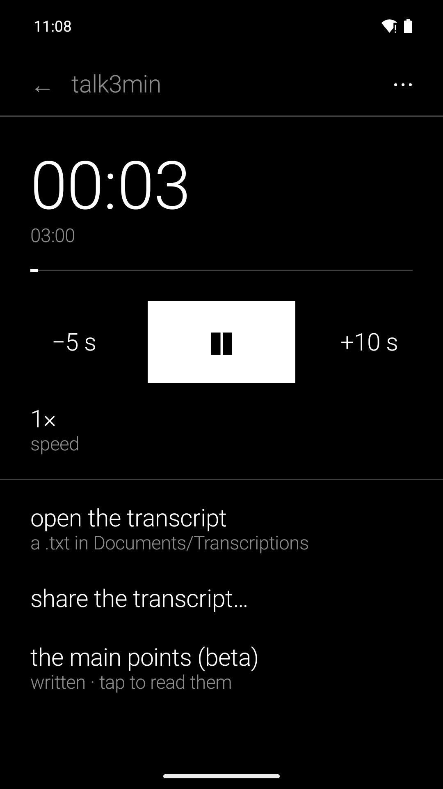

# Reader's Audio Player

Plays audio files and resumes each where it was left; speed 0.8–2×, lock-screen and Bluetooth
controls, a resume widget. Transcribes on the phone with whisper.cpp into .txt files any app
opens — nothing is uploaded. Black and white, text only, six languages; one of the
[Reader's](https://github.com/funkypitt/readers-launcher) apps.

## Key points

* One list, last played first. "+ open audio files" picks files anywhere on the phone; "open
  with" and "share to" from any app work too.
* The player: tap the line to jump; −5 s · ▶ / ❚❚ · +10 s; speed. The same controls are in the
  notification and on the lock screen.
* Transcribe: a sheet asks the language spoken and the quality — normal (Whisper small, 190 MB)
  or high, much slower (large-v3-turbo, 574 MB). The model is fetched once.
* The transcript is a plain `.txt` in Documents/Transcriptions; Reader's Books opens it.
* Main points (beta, off by default): a model of about 2 GB, fetched on the first tap, writes
  them at the top of the same `.txt`. Not offered on a phone with less than about 6 GB of memory.
* Translate: a transcript already made is put into the phone's language, on the phone, by a
  2.5 GB model (Gemma 3 4B) fetched on the first use — for a phone of 8 GB. The translation is a
  second `.txt` beside the first, `<title> (en).txt`.
* Share the audio or the transcript, or "save a copy to a folder…" from the player.
* Widget: the last file played; ▶ resumes it, the title opens the player.
* No storage permission, no account. The network is used only to fetch the models, which are
  shared with Reader's Recorder: nothing is downloaded twice.

More detail: [docs/NOTES.md](docs/NOTES.md).

## Install

From the F-Droid repo `https://funkypitt.github.io/fdroid-repo/repo`, or the APK of the
[latest release](https://github.com/funkypitt/readers-audio/releases/latest).

## Build

```
git clone --recursive https://github.com/funkypitt/readers-audio.git   # or: git submodule update --init
export JAVA_HOME=/path/to/jdk-21
./gradlew assembleDebug
```

minSdk 29, targetSdk 34, NDK 27.1, CMake 3.22.1. `speech/` is the
[readers-speech](https://github.com/funkypitt/readers-speech) submodule; keep `ndkVersion` in
`app/build.gradle.kts`, or the native libraries ship unstripped.

## Licence

MIT. Media3 is Apache 2.0, whisper.cpp MIT.

## Captures d'écran

 
